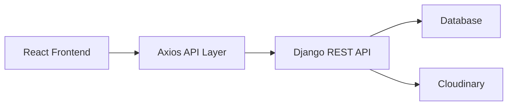

# Blogify

A full-stack blogging platform built with React and Django REST Framework. Blogify lets users register, sign in, create and manage blog posts, update their profile, explore other authors, and interact with a clean responsive interface backed by a production-ready REST API.

## Live Demo

- Frontend: [https://blogifynew.netlify.app/](https://blogifynew.netlify.app/)
- Backend API: [https://blogify-y7i3.onrender.com](https://blogify-y7i3.onrender.com)

## Why This Project Matters

This project demonstrates practical full-stack engineering skills that are highly relevant for internships and entry-level software roles:

- Building and consuming REST APIs
- Implementing JWT-based authentication
- Managing protected routes and session state on the client
- Handling file uploads for profile pictures and blog images
- Designing relational data models for users and posts
- Deploying frontend and backend services separately
- Connecting a React SPA with a hosted Django backend

## Key Features

- User registration and login with JWT authentication
- Protected create/update/delete flows for blog ownership
- Public blog listing with pagination
- Individual blog detail pages using slug-based routes
- User profile pages with author-specific posts
- Profile editing with image upload support
- Blog image upload support via Cloudinary
- Responsive UI with dark mode support

## Tech Stack

| Layer | Technology |
|---|---|
| Frontend | React, Vite, React Router |
| Styling | Tailwind CSS, Radix UI |
| Forms | React Hook Form |
| HTTP Client | Axios |
| Backend | Django, Django REST Framework |
| Authentication | Simple JWT |
| Database | PostgreSQL or SQLite-compatible Django setup |
| Media Storage | Cloudinary |
| Deployment | Netlify (frontend), Render (backend) |

## Architecture Overview



## What The Application Supports

### Authentication

- New users can create an account
- Registered users can sign in and receive JWT access and refresh tokens
- Protected frontend routes restrict access to post creation
- Authenticated API requests automatically attach the access token

### Blogging Workflow

- Users can create blog posts with title, category, content, and image
- Published posts are displayed on the home page
- Each post has a slug for readable routing
- Authors can edit or delete only their own posts

### Profiles

- Every author has a public profile page
- Users can update profile details such as name, bio, job title, and picture
- Profile pages show recent posts from that author

## Project Structure

```text
02_Blog App/
|-- Backend/
|   |-- Blog_api/
|   |   |-- Blog_api/
|   |   |-- blogapp/
|   |   |-- manage.py
|   |   `-- requirements.txt
|   `-- requirements.txt
|-- Frontend/
|   `-- Blogify/
|       |-- src/
|       |-- public/
|       |-- package.json
|       `-- vite.config.js
`-- README.md
```

## API Highlights

Example backend routes:

- `POST /register_user/` - register a new user
- `POST /token/` - log in and receive JWT tokens
- `GET /blog_list/` - fetch paginated published blogs
- `GET /blogs/<slug>/` - fetch a single blog post
- `POST /create_blog/` - create a new blog
- `PUT /update_blog/<id>/` - update an existing blog
- `POST /delete_blog/<id>/` - delete a blog
- `PUT /update_user/` - update current user profile
- `GET /get_userinfo/<username>/` - fetch public profile data

## Local Setup

### 1. Clone the Repository

```bash
git clone <your-repo-url>
cd "02_Blog App"
```

### 2. Backend Setup

```bash
cd Backend/Blog_api
python -m venv venv
venv\Scripts\activate
pip install -r requirements.txt
python manage.py migrate
python manage.py runserver
```

Create a `.env` file inside `Backend/Blog_api` with:

```env
SECRET_KEY=your-secret-key
DEBUG=True
DATABASE_URL=your-database-url
ALLOWED_HOSTS=127.0.0.1,localhost
VITE_FRONTEND_URL=http://localhost:5173
CLOUDINARY_CLOUD_NAME=your-cloud-name
CLOUDINARY_API_KEY=your-api-key
CLOUDINARY_API_SECRET=your-api-secret
```

### 3. Frontend Setup

```bash
cd Frontend/Blogify
npm install
npm run dev
```

Create a `.env` file inside `Frontend/Blogify` with:

```env
VITE_BASE_URL=http://127.0.0.1:8000/
```

## Deployment Notes

### Frontend

- Platform: Netlify
- Root directory: `Frontend/Blogify`
- Build command: `npm run build`
- Publish directory: `dist`

### Backend

- Platform: Render
- Root directory: `Backend/Blog_api`
- Build command: `pip install -r requirements.txt`
- Start command: `gunicorn Blog_api.wsgi:application`
- Recommended release command: `python manage.py migrate`

## What I Learned Through This Project

- How to design and expose REST endpoints for a real product workflow
- How to secure routes and resource ownership using JWT and backend checks
- How to structure frontend pages around reusable UI components
- How to integrate third-party media storage for uploaded content
- How to deploy a decoupled frontend and backend application

## Possible Future Improvements

- Add rich text editing for blog content
- Add comments, likes, and bookmark support
- Add search, filters, and category pages
- Improve automated test coverage for backend and frontend flows
- Add refresh-token handling improvements and stronger error states

## Author

Shivam Chaurasiya

If you are a recruiter, interviewer, or collaborator reviewing this project, this repository reflects my hands-on experience with frontend development, backend APIs, authentication, deployment, and end-to-end product thinking.
